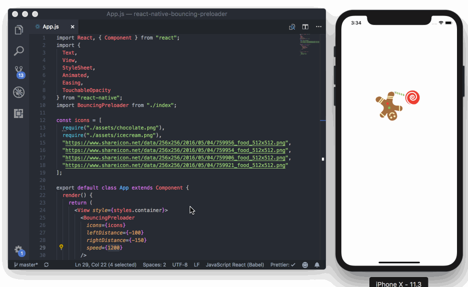

[](https://reactnative.gallery)
# React Native Bouncing Preloader

Bouncing Preloader Component with custom icons in React Native




Based on the dribbble shot by [Dany Rizky](https://dribbble.com/danyrizkyw):
https://dribbble.com/shots/4423936-Islands-Preloader-Animation


#### Demo

https://snack.expo.io/@sonnylazuardi/testing-preloader

#### Background

When I saw the preloader animation, I think it would be great if we can use our own icon and give more control to the bouncing animation and rotation. So I tried to make this open source component.

#### Goals

* Animate our own custom icon
* Flexible to use remote image url or local image file
* Able to control distance, rotation angle etc

#### Usage

* `npm install --save react-native-bouncing-preloaders`
* In your react native script add these lines

```jsx
import BouncingPreloader from 'react-native-bouncing-preloaders';

<BouncingPreloader
  icons={[
    'https://www.shareicon.net/data/256x256/2016/05/04/759946_bar_512x512.png',
    require('./assets/image.png'),
  ]}
  leftRotation="-680deg"
  rightRotation="360deg"
  leftDistance={-180}
  rightDistance={-250}
  speed={1200} />

// or just give icons

<BouncingPreloader
  icons={[
    require('./assets/image1.png'),
    require('./assets/image2.png'),
  ]}/>
```

### Available props

| Props         | Type          | Required           | Default Value |
| ------------- | ------------- | ------------------ | ------------- |
| icons         | Array         | :white_check_mark: | :x:           |
| leftRotation  | String        | :x:                | -680deg       |
| rightRotation | String        | :x:                | 360deg        |
| leftDistance  | String        | :x:                | -180          |
| rightDistance | Number        | :x:                | -250          |
| speed         | Number        | :x:                | 1200          |
| size          | Number        | :x:                | 150           |

#### Contributing

* Feel free to open PR.

#### Examples

[Expo Example](https://snack.expo.io/@sonnylazuardi/testing-preloader)

Most of the credit goes to [Dany Rizky](https://dribbble.com/danyrizkyw) for the design inspiration.

#### License

MIT Licensed
